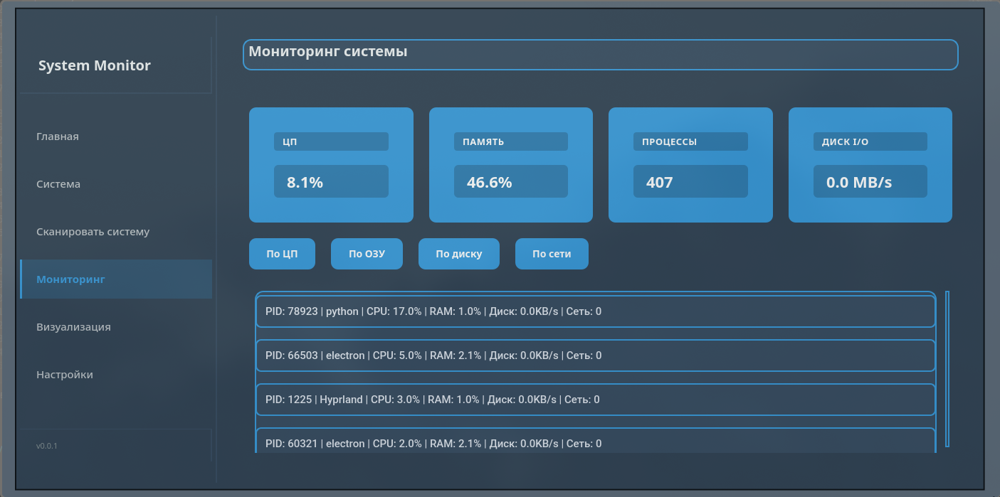
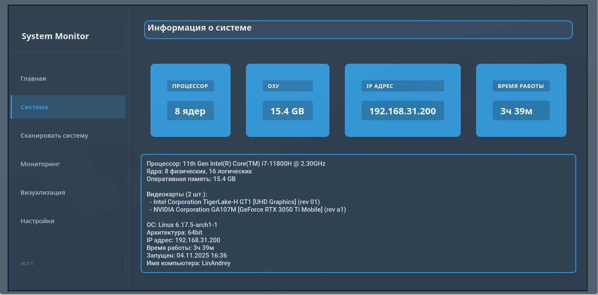
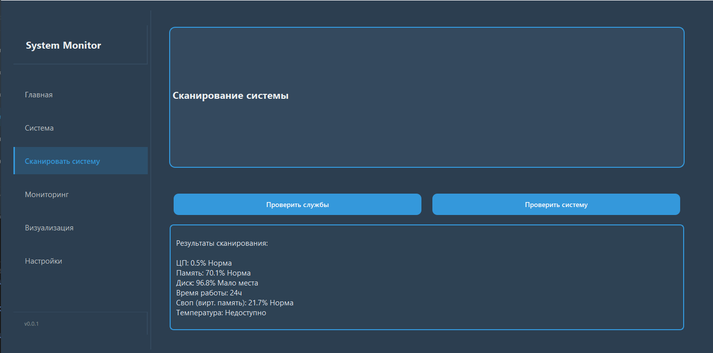

# System Monitor

## Авторы

Краснов Андрей Юрьевич, 9 класс

## Описание идеи

System Monitor - это кроссплатформенное приложение для комплексного мониторинга и управления компьютерной системой. Программа объединяет в себе функции системного мониторинга и настройками системы. Основная идея - создать единый инструмент для анализа и управления системой.

## Описание реализации

**Архитектура приложения:**

- **App** - главный класс приложения, инициализирует окно и запускает программу
- **MainPage** - основной контроллер с боковой панелью навигации и системой страниц
- **CustomWindow, CustomSidebar, CustomPanel** - кастомные UI компоненты с единым дизайном

**Функциональные модули:**

- **dashboard.py** - главная страница с общей информацией о системе
- **system_page.py** - детальная информация о железе (CPU, RAM, GPU)
- **monitoring_page.py** - реалтайм мониторинг процессов с сортировкой и автообновлением
- **scan_system.py** - сканирование служб и проверка здоровья системы через отдельные потоки
- **settings_page.py** - панель управления системными параметрами

**Ключевые классы:**

- **MonitoringWidget** - виджет с таймером для отслеживания процессов каждые 3 секунды
- **ScanWorker(QThread)** - фоновый поток для сканирования
- **CustomCard** - информационные карточки

**Система шаблонов:**
CSV файлы с эталонными службами для Linux и Windows, позволяющие сравнивать текущее состояние с нормой.

## Технологии и библиотеки

**Основные технологии:**

- **Python 3.8+** - основной язык разработки
- **PyQt6** - современный фреймворк для создания GUI с поддержкой CSS стилизации
- **psutil** - кроссплатформенная библиотека для получения системной информации (CPU, память, процессы)
- **subprocess** - выполнение системных команд для проверки служб
- **csv** - работа с шаблонами служб в табличном формате
- **platform** - определение операционной системы для адаптации функций
- **QThread** - многопоточность для неблокирующих операций сканирования

**Необходимые для запуска библиотеки:**

```
pip install -r requirements.txt
```
Или
```
python -m venv venv
```
Для Windows:
```
venv\Scripts\activate
```
Для macOS и Linux:
```
source venv/bin/activate
```
```
pip install -r requirements.txt
```
**Поддерживаемые операционные системы:**

- Linux Arch-подобные
- Windows 10/11

## Скриншоты



